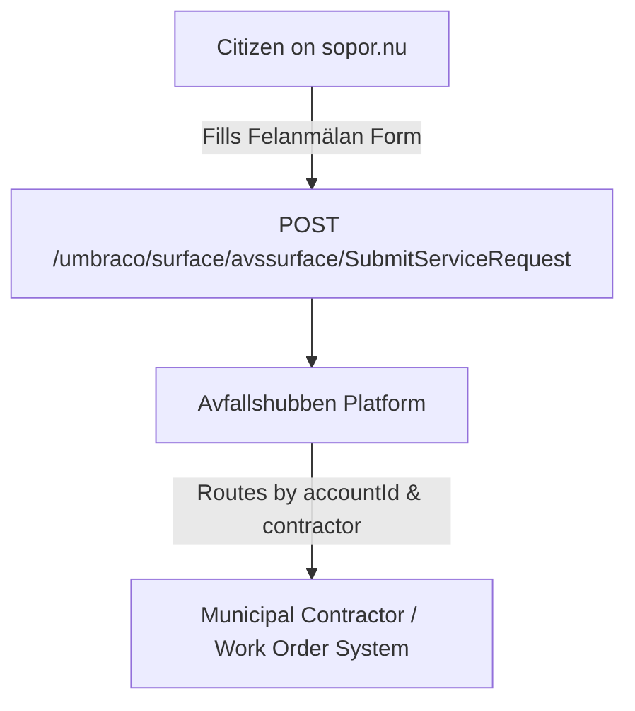

# Citizen Issue Reporting (Felanmälan) API

The issue reporting system (*felanmälan*) on `sopor.nu` allows citizens to notify municipal authorities and contractors when a recycling station needs immediate attention—such as full containers, dumped litter, or snow/ice hazards.

---

## Overview & Routing Flow

When a user visits `/haer-aatervinner-du/felanmael-aatervinningsstation?avs={id}&kommun={code}`, the page inspects the station's control flags:

1. `disableServiceRequestReportingToUser`: If `true`, reports cannot be submitted via the national portal.
2. `customServiceRequestUrl`: If populated, the citizen is redirected to the municipality's own reporting portal.
3. If reporting is allowed on `sopor.nu`, the report is posted to the Umbraco Surface Controller.

---

## Submission Endpoint

- **Method**: `POST`
- **URL**: `https://www.sopor.nu/umbraco/surface/avssurface/SubmitServiceRequest`
- **Content-Type**: `multipart/form-data` (supports image file upload)
- **Authentication**: Antiforgery token (`__RequestVerificationToken`)

---

## Taxonomy of Issues & Service Codes

The form uses a structured checkbox system where values are formatted as `{serviceCode}:{subType}`:

### 1. Container Needs Emptying (`needsEmptying`)

Sent when one or more recycling containers are full or overflowing:

| Form Field | Value | Fraction | English Description |
| --- | --- | --- | --- |
| `needsEmptying` | `101:1` | Pappersförpackningar | Paper and cardboard packaging |
| `needsEmptying` | `102:2` | Plastförpackningar | Plastic packaging |
| `needsEmptying` | `103:3` | Metallförpackningar | Metal packaging |
| `needsEmptying` | `104:4` | Ofärgade glasförpackningar | Clear glass packaging |
| `needsEmptying` | `105:5` | Färgade glasförpackningar | Coloured glass packaging |
| `needsEmptying` | `106:6` | Tidningar och andra trycksaker | Newspapers and magazines |
| `needsEmptying` | `107:7` | Batterier | Battery collection box |
| `needsEmptying` | `108:8` | Textil | Textile container |

### 2. Site Needs Cleaning (`needsCleaning`)

Sent when waste or debris has been dumped on the station grounds:

| Form Field | Value | Sub-category | English Description |
| --- | --- | --- | --- |
| `needsCleaning` | `109:2` | Grovavfall | Bulky waste (furniture, mattresses, construction debris) |
| `needsCleaning` | `109:3` | Hushållsavfall | Household garbage bags dumped outside bins |
| `needsCleaning` | `109:4` | Farligt avfall | Hazardous materials (car batteries, paint cans, chemicals) |
| `needsCleaning` | `109:5` | Tidningar och papper | Loose paper and cardboard scattered by wind |

### 3. Winter Maintenance (`winterManagement`)

Sent when snow or ice prevents safe access for citizens or collection vehicles:

| Form Field | Value | Sub-category | English Description |
| --- | --- | --- | --- |
| `winterManagement` | `110:6` | Halkbekämpning | Ice control (station area is slippery, needs gritting/salt) |
| `winterManagement` | `110:7` | Snöröjning | Snow clearing (drifts blocking container openings or parking) |

---

## Form Parameters Reference

| Field Name | Type | Required | Description |
| --- | --- | --- | --- |
| `guid` | `string (UUID)` | Yes | The internal `accountId` of the municipality in Avfallshubben |
| `externalAvsId` | `string` | Yes | The station ID (e.g. `11045`) |
| `municipalityCode` | `string` | Yes | 4-digit municipality code (e.g. `0114`) |
| `needsEmptying` | `string[]` | No | One or more checkbox values from the emptying taxonomy above |
| `needsCleaning` | `string[]` | No | One or more checkbox values from the cleaning taxonomy above |
| `winterManagement` | `string[]` | No | One or more checkbox values from the winter taxonomy above |
| `date` | `string (datetime)` | Yes | Timestamp of citizen observation (`YYYY-MM-DD HH:mm`) |
| `picture` | `file (binary)` | No | JPEG/PNG photograph of the full container or litter |
| `description` | `string` | No | Optional free-text details (unless disabled by station flag) |
| `firstName` | `string` | No | Reporter's first name |
| `lastName` | `string` | No | Reporter's last name |
| `email` | `string` | No | Reporter's email for status confirmation |
| `phone` | `string` | No | Reporter's phone number |
| `consent` | `string (boolean)` | Yes | GDPR consent checkbox (`true`) |
| `__RequestVerificationToken` | `string` | Yes | CSRF token generated by Umbraco |
